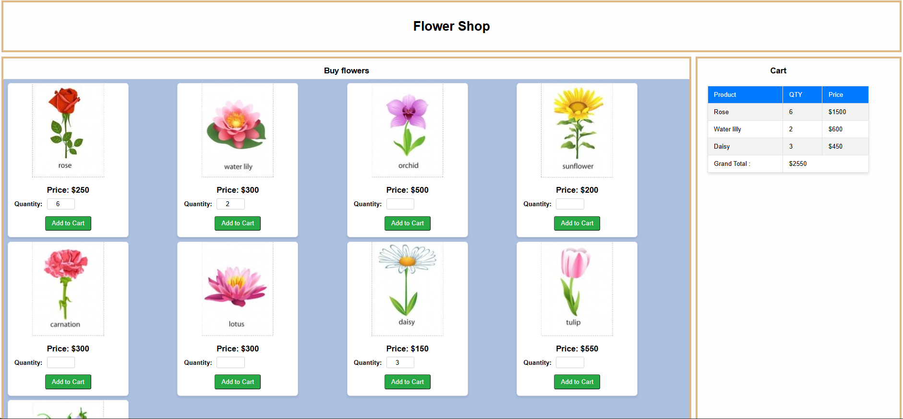

# Online-Flower-Shop

An online flower shop e-commerce application built using React. This project allows users to browse a list of flowers, add them to a shopping cart with specified quantities, and view the total cost of their purchase.

---

## Features

- Display a list of flowers with images, names, and prices.
- Allow users to select quantities and add flowers to a shopping cart.
- Display a shopping cart with the selected items, quantities, individual totals, and the grand total.
- Responsive design using CSS.

---

## Technologies Used

- Frontend: React, JavaScript
- Styling: CSS
- Development Environment: Visual Studio Code

---

## File Structure

```json
src/
├── assets/
│   ├── CSS/
│   │   └── layout.css  # Stylesheet for the application
│   └── image/          # Folder containing flower images
├── components/
│   ├── Cart.js         # Component for displaying the shopping cart
│   ├── Product.js      # Component for displaying a single flower
│   └── Products.js     # Main component integrating Product and Cart
├── FlowerDB.js         # Flower database with product details
├── App.js              # Entry point for the application
└── index.js            # React DOM rendering

```

---

## Setup and Installation

**Follow these steps to run the application locally:**

1. Clone the Repository

```bash
git clone https://github.com/yourusername/flower-shop.git
cd flower-shop
```

2. Install Dependencies
   Make sure you have Node.js installed. Run the following command:

```bash
npm install
```

3. Start the Application

```bash
npm start
```

The application will run on `http://localhost:3000`.

---

## Usage Instructions

1. **Browse Products:**
   View available flowers with images, prices, and names.
2. **Add to Cart:**
   Specify the quantity for each flower and click the Add to Cart button.
3. **View Cart:**
   Check the selected items, their quantities, individual prices, and the total cost.

---

## Output



---

## **Conclusion**

This Flower Shop E-Commerce Application provides a simple yet effective way for users to browse and purchase flowers online. With the use of React, we've been able to create an interactive and dynamic experience that allows users to select flowers, specify quantities, and view their cart details in real-time. The project also demonstrates the power of React for building modular components and managing state efficiently.

---
